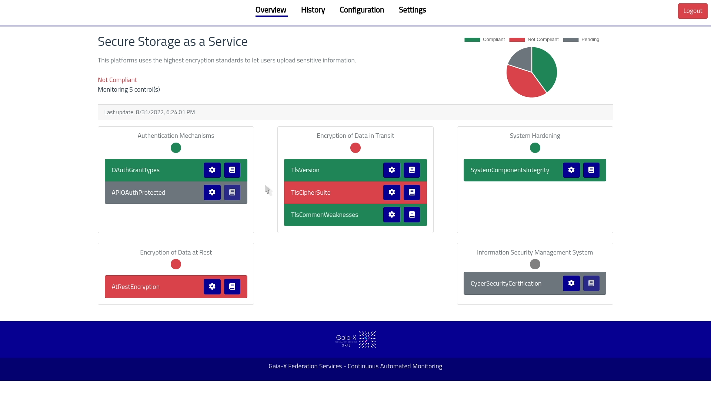
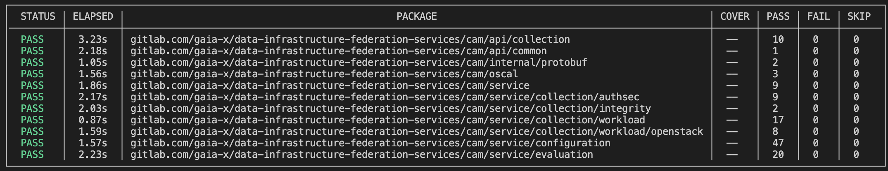

# Continuous Automated Monitoring

[](https://pkg.go.dev/gitlab.eclipse.org/eclipse/xfsc/cam)
[](https://goreportcard.com/report/gitlab.eclipse.org/eclipse/xfsc/cam)

This project contains the reference implementation of the Gaia-X Continuous Automated Monitoring component.



# Usage

## Docker Compose

To test CAM locally, you can use the supplied `docker-compose.yml` file, that spins up a local test environment. Once you issued `docker compose up` you can access the dashboard on http://localhost:8080. You can login using the credentials `admin` / `admin`.

## Installation via Helm

Assuming that you have access to a Kubernetes cluster, are in the right Kubernetes context, and have helm installed:
```
git clone https://gitlab.eclipse.org/eclipse/xfsc/cam.git
helm upgrade --install your_name_here cam/helm
```

This method is however not recommended as our Helm files are specific to the dev / staging environment.

## Manual Deployment of Microservices

The `cmd` folder contains the main entry points for the individual microservices and additional binaries that comprises
the overall CAM service. Each binary can be build using `go build (service)/(service).go`, for example `go build
cmd/cam-api-gateway/cam-api-gateway.go`. The binary itself is then available in the root workspace folder and is named
`(service)`, e.g., `cam-api-gateway`. The following table contains a list of all micro-services.

| Name                       | Description                                   | Default Port |
| -------------------------- | --------------------------------------------- | ------------ |
| `cam-api-gateway`          | The CAM API gateway (including the Dashboard) | 8080         |
| `cam-req-manager`          | The Requirements Manager                      | 50100        |
| `cam-eval-manager`         | The Evaluation Manager                        | 50101        |
| `cam-collection-commsec`   | Communication Security Collection Module      | 50051        |
| `cam-collection-authsec`   | Authentication Security Collection Module     | 50052        |
| `cam-collection-integrity` | Remote Integrity Collection Module            | 50053        |
| `cam-collection-workload`  | Workload Configuration Collection Module      | 50054        |
| `cam-collection-registry`  | Public Registry Collection Module             | 50055        |

The `--help` or `-h` flag can be used to display additional configuration flags, depending on the actual service. For example in the case of `cam-api-gateway`:

```bash
The CAM API Gateway serves as central gateway to expose the functionality of different CAM micro-service using a central REST API.

Usage:
  cam-api-gateway [flags]

Flags:
      --configuration-service-address string   Specifies the address of the configuration service (cam-req-manager) (default "localhost:50100")
      --evaluation-service-address string      Specifies the address of the evaluation service (cam-eval-manager) (default "localhost:50101")
  -h, --help                                   help for cam-api-gateway
```

## API

All services communicate via gRPC. The respective protobuf files can be found in the `api` folder. Additionally, certain services are also exposed as REST via a gRPC gateway (contained in the `cam-api-gateway` component). In this case an OpenAPI specification is also available.

| Name               | gRPC Service Name | gRPC API Definition                                            | OpenAPI definition                               |
| ------------------ | ----------------- | -------------------------------------------------------------- | ------------------------------------------------ |
| `cam-req-manager`  | Configuration     | [configuration.proto](./api/configuration/configuration.proto) | [openapi.yaml](./api/configuration/openapi.yaml) |
| `cam-eval-manager` | Evaluation        | [evaluation.proto](./api/evaluation/evaluation.proto)          | [openapi.yaml](./api/evaluation/openapi.yaml)    |
| `cam-collection-*` | Collection        | [collection.proto](./api/collection/collection.proto)          | not exposed as REST                              |

# Development

## Testing

All unit and Gherkin tests are executed automatically at each CI commit. In order to test the functionality locally, you can use the `go test ` command. Ideally in combination with the `tparse` tool for a nicer output:

```bash
go install github.com/mfridman/tparse@latest
go test ./... -json | tparse -follow
```

This should provide an overview like the following picture.



## How to Add a New Collection Module

Our approach using a microservice architecture is also reflected at the level of collection modules (CMs).
Thus, adding a new collection module is straight forward.
But still you have to adjust some parts of the other code as well (in particular in the current version of the reference implementation).
The following steps are needed in case you want to add a new CM:
- Creating a new metric (technical description of a requirement, e.g. part of a control in the EUCS)
- Defining a configuration for the CM (in accordance to the metric definition)
- Implement the CM
- Update the Requirements Manager
- Update the Dashboard

We will use a running example to make it more comprehensible.
We assume that we have a new requirement (metric) that requires to do health checks on certain endpoints.

### 1. Creating a New Metric

Before there is a new collection module, there has to be the reason for it - a new metric.
In our example that is the *HealthCheck* metric.
This metric first has to be defined and included into the CAM service.
In the future, we plan to make the creation of metrics part of the UI.
But for now, we need to put our hands on and enter the code ourselves.

#### Add Metric Definition

Look at the *./policies/bundles/* folder to see which metrics are in place currently.
We add a new metric by creating a folder there with the name of the metric (*HealthCheck* in our example. Notice the CamelCase!) and describe it via the metric.rego / data.json files.
We use the policy language *Rego* of the *OPA* policy engine.
See [here](https://www.openpolicyagent.org/docs/latest/#overview) for more information about those files.
In our health check example we would, e.g., use a status in binary form: the health check is either enabled or *
disabled (*enabled* is true or false).

*metric.rego*:
```rego
package xfsc.metrics.health_check

import data.clouditor.compare

default applicable = false

default compliant = false

enabled := input.healthcheck.enabled

applicable {
	enabled != null
}

compliant {
	compare(data.operator, data.target_value, enabled)
}
```

*data.json*:
```json
{
  "operator" : "==",
  "target_value" : true
}
```

#### Update OSCAL File

We also need to update our catalog to include the newly created metric.
The `./xfsc.json` file represents our catalog written in the [OSCAL](https://pages.nist.gov/OSCAL/) format.
If we decide that the metric is addressing the "System Hardening" control (for reasons of simplicity), we would add it to the list of current metrics in place (consisting of `SystemComponentsIntegrity`):
```json
{
    "id": "OPS-21",
    "title": "System Hardening",
    "props": [
        {
            "name": "metrics",
            "value": "SystemComponentsIntegrity,HealthCheck"
        }
    ]
},
```
Note: If there is a new control, we would simply add it in this file as well, i.e. by defining *id*, *title* and the *metrics*.

#### Update Metric configuration

Add the metric configuration in *./metrics.json*.
In our example, the range is of binary nature (either the healthcheck is true or false).
The interval defines how often the metric should be evaluated.

```json
{
  "id": "HealthCheck",
  "name": "AtRestHealthCheckEncryption",
  "description": "This metric is used to assess if the asset is alive",
  "scale": 1,
  "range": {
    "allowedValues": {
      "values": [
        "true",
        "false"
      ]
    }
  },
  "interval": 300
}
```

### 2. Define Collection Module Configuration

We now have incorporated the metric which will be used by the Evaluation Manager to evaluate incoming evidences of the Collection Module.
But before implementing the logic of gathering the evidences, we have to define the configuration for our healthcheck CM.
It is important since the user (the auditor) has to know what he or she has to enter (visualized in the dashboard).

Go to the API definition of our collection modules, the collection interface written in [protobuf](https://developers.google.com/protocol-buffers/): *./api/collection/collection.proto*.
In our example, we have to define a new configuration message HealthCheckConfig which contains a `url` field of type string.
```proto
message HealthcheckConfig {
  string url = 1;
}
```

### 3. Implement the Collection Module

Upon a `StartCollecting` request (in form of a remote procedure call, RPC. See collection interface in the API directory) of the Requirement Manager (which in turns is triggered by the auditor in the Dashboard), a collection module gathers the required information based on the passed configuration (see step 2) to build a so-called evidence.
Then, this evidence is finally sent to the Evaluation Manager via the `SendEvidence` RPC (see evaluation interface in the API directory).

In the following we give a guidance:

- Set Up the Code Base
  - Create a new service healthcheck in the `./service` directory:
  - Create a Service struct which implements the server side of the collection interface (gRCP tip: Embed the UnimplementedCollectionServer struct)
  - Create a Value struct representing the value of an evidence. It has to be aligned to the structure you defined in the metric (use JSON tags). For technical reasons of the Evaluation Manager is using the Clouditor behind the scenes, you have to use also a (anonymous) field of type *voc.Resource*.

- Implement the evidence collection:
  - Implement the `StartCollecting` interface method
  - Use the *evidence* struct defined in the common package in the *api* folder
  - Use your own defined Value of previous step. In the internal package there is a helper function `ToStruct[T any](value *structpb.Value) (strct T, err error)` to convert it.
You have to set at least the fields *id* (non-empty string) and *type* (at least one non-empty element) of *voc.Resource*. Otherwise the Evalution will fail later on (technical reasons of the used Clouditor)
For the *ToolId* field, create a new constant in *internal/config/config.go*. Generate (e.g. with a generator in the internet) and use a valid UUID. We will need it later on again.
  - Send the evidence via the Send method of the evaluation interface (in this case, you are the client). Tip: Leverage the StreamsOf type of the Clouditor API (*clouditor.io/clouditor/api*)
- We all love writing tests:
  - Add some tests for StartCollectiong to mainly test the validation part
  - Add some tests for the actual collection of evidence. For that, you can extract this functionality in a separate method and test it
  - Optional: If you really want, you could also mock the Evaluation Manager to test that the right evidences are sent upon a StartCollectiong request.

Note: We ignore the StopCollecting RPC.
TL;DR: It will be excluded in the next updated specification.

According to the current specification, a collection module should continuously collecting evidences - until the Requirement Manager stops it via this RPC.
But we made a design decision to let the collection module be "dumb" as possible, meaning it should be stateless and just be executed as a one time job on each start call.
This fire and forget approach makes the StopCollecting RPC needless.
Among other things, this will be updated in the new specification in a following project.

- Implement the executable file.
A typical structure of Go projects contains a *cmd* directory at the root level.
This directory is the place where binaries are built, e.g. for each service a subfolder containing a single "main" Go file.
A new Collection Module is also a service:
  - Create the respective subfolder in *./cmd* (naming is not crucial here, but the best practice is to stick to the existing scheme that is already in place.)
  - In your service code, implement a `NewServer` method (a "constructor") which creates a `collection.CollectionServer` to create a new healthcheck service with default values.
  - Implement the "main" file:
    - Create a gRCP server
    - Create a `HealthCheck` service with `NewServer`
    - Pass it to the gRCP Server
    - Use next available port for CMs: In this case, *50055*
  - Create a Dockerfile here which builds the CM for production in a Kubernetes cluster.

### 4. Update the Requirements Manager

Currently, we have to manually add the new collection module to the Requirements Manager.
We will add this functionality directly to the Dashboard in the future.
But for now, we use the `autoCreateCollectionModules` method in the Requirements Manager which will create all collection modules at the start when running it.

Go to *./cmd/cam-req-manager/cam-req-manager.go* and add the new HealthCheck module in `autoCreateCollectionModules`.
Bear in mind the following points:
- The metric name must be identical to the respective folder name of the metric.
- As `ID` use the `ToolID` you created earlier in configs
- For the `ConfigMessageTypeUrl`, use `protobuf.TypeURL` to extract the URL from the healthcheck configuration you created in Step 2.

### 5. Update Dashboard

The metrics and controls are automatically displayed in the Dashboard.
So there is nothing to do here.
But we need to add the configuration for the new collection module.
In our example, we would modify *./dashboard/src/data/model.ts* like this:
- Add the type to the `BaseConfig` interface
```typescript
export interface BaseConfig {
  "@type": "type.googleapis.com/cam.CommunicationSecurityConfig" |
  "type.googleapis.com/cam.WorkloadSecurityConfig" |
  "type.googleapis.com/cam.RemoteIntegrityConfig" |
  "type.googleapis.com/cam.AuthenticationSecurityConfig" |
  "type.googleapis.com/cam.HealthCheckConfig"
}
```
- Implement the interface. In our case, we only need one parameter, a URL
```typescript
export interface HealthCheckConfig extends BaseConfig {
  //"@type": "type.googleapis.com/cam.HealthCheckConfig"
  url: string
}
```
- We also need to add this `HealthCheckConfig` option to our rawConfiguration property. 
```typescript
export interface ServiceConfiguration {
  serviceId: string
  rawConfiguration: CommunicationSecurityConfig |
  AuthenticationSecurityConfig |
  RemoteIntegrityConfig |
  WorkloadSecurityConfig |
  HealthCheckConfig
}
```

Note: The naming of the configuration in the Dashboard (`HealthCheckConfig`) has to be equal to the one defined in the configuration in step 2. Otherwise, the Requirement Manager can't understand incoming configurations from the Dashboard.

# Clarifications of the Specification

This implementation follows closely the specification of the [Continuous Automated Monitoring](https://www.xfsc.eu/download/1731/) component of the Gaia-X Federated Services. However, there are minor clarifications to the specification that we chose because the specification was ambiguous or contradictory.

## General

* Usage of `String` instead of `Int` for all ID fields: All ID fields are now UUIDs and their internal protobuf representation is a string. This was necessary for two reasons: First, some ID fields need to be compatible with OSCAL (such as the control ID) and their identifiers follow a string-based approach. Second, some identifiers, such as as the evidence ID need to be uniquely generated on their own by the collection modules, which makes it ideally suited for a UUID. This change is purely internal, as the change of representation to the outside world via the REST API is transparent.
* The specification did not include a path layout for the REST API. A sensible, future-compatible approach using a numbered schema, such as `/v1/configuration` has been chosen.

## Interface Modifications

* The specification was missing function calls to add/edit/remove target cloud services. Appropriate RPC calls, such as `RegisterCloudService` have been added to the `Configuration` service interface and exposed via the REST API.
* The `Configuration` interface also lacked a possibility to configure the needed `ServiceConfiguration` for a particular cloud service. This functionality has been added via the `ConfigureCloudService` function call.
* A `ListControls` call has been added to the `Configuration` interface, that returns a list of all relevant controls configured in the CAM.
* Function calls to list and retrieve a particular evidence from the evaluation manager have been added to the `Evaluation` service interface in the form of `ListEvidence` and `GetEvidence` and exposed via the REST API.
* Added `CalculateComplianceRequest` to the `Evaluation` service interface to trigger compliance calculation from the requirement manager.
* The field `metric_id` has been removed from the `StartCollectingRequest` since collection modules do not have a strong coupling to metrics any more.
* The RPC call `FindCollectionModule` has been removed, since collection modules do not have a strong coupling to metrics anymore.

## Object Modifications

* An `Error` object class has been introduced and added as a property `error` to the `Evidence` class. The reasoning behind this, is that during the evidence collection an error might occur that leads to the generation of a corrupt / invalid evidence. Instead of silently ignoring errors, these can now be sent to the evaluation manager for further processing.
* The field `gathered_using` in `Evidence` has been removed. A collection module is not tied directly to one metric and since the collection modules creates the evidence, this field has no meaning.
* The field `metric` of `CollectionModule` has been extended to `metrics` and specifies a list of metrics that the collection module feels responsible for. In the future, however we want to completely de-couple metrics and collection modules, so this field might get removed again.
* * The `raw_configuration` field in `ServiceConfiguration` is now specified as a `google.protobuf.Any` field, which allows embedded any protobuf message that represents the service configuration needed for the collection module. 
* The `CollectionModule` object now has field `config_message_type_url` which corresponds to the type URL of the `raw_configuration` that the collection module expects in its `StartCollectingRequest`.
