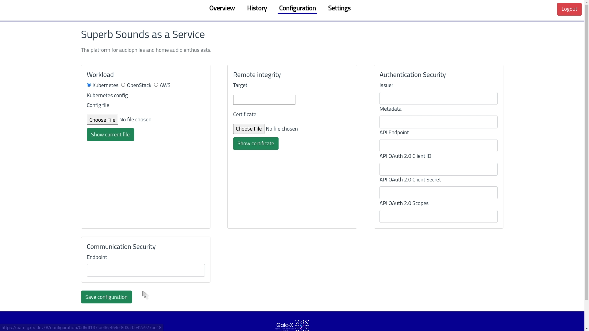

# CAM Dashboard
This is the dasboard for CAM.
To build the page run
 `npm run build`.
 Serve the */dist* directory with a webserver.

## Get An Overview about All Currently Monitored Services

## See Detailed View of a Monitored service

## Show and Inspect the Monitoring History

## Start and Stop Monitoring Services

## Configure a Service

